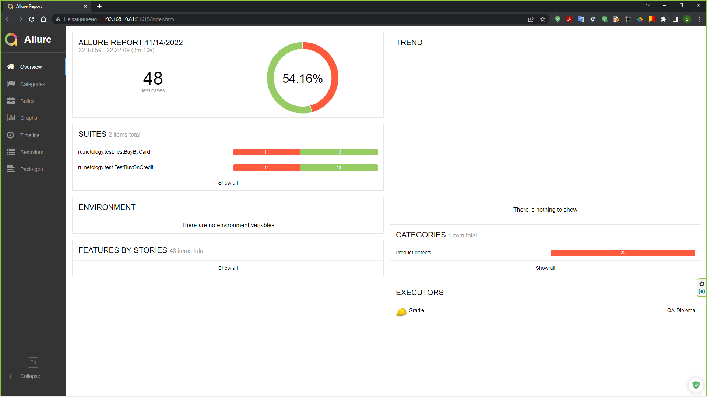
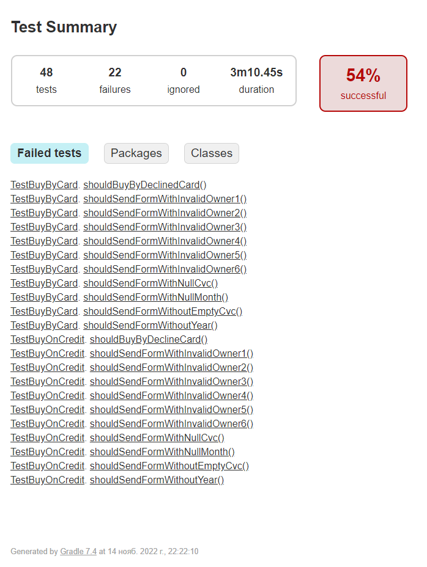

# Отчёт по итогам автоматизированного тестирования.

## Краткое описание

На начальном этапе было проведено исследовательское (ручное) тестирование для ознакомления с проектом.

На следующем этапе были созданы автотесты, согласно [Плана автоматизации тестирования.](https://github.com/Mozly76/QA-Diploma/blob/main/docs/Plan.md).

Проведено автоматизированное тестирование сервиса, включающее в себя проверку позитивных и негативных сценариев покупки тура, тестирование UI, БД.

Протестирована возможность собственной СУБД сохранять информацию о том, каким способом был совершён платёж и успешно ли он был совершён.

Тестирование проведено для двух БД - MySQL и PostgreSQL.

В систему автоматизации тестирования интегрирован отчёт Allure.

## Количество тест-кейсов

**Всего:** 48 тест-кейсов (4 позитивных, 44 негативных).
- Успешных: 26 тест-кейсов - 54.16 %;
- Неуспешных: 22 тест-кейса - 45.84 %.

Отчет о тестировании Allure:

Отчет о тестировании Gradle:

На все выявленные ошибки были заведены репорты в [Issues](https://github.com/Mozly76/QA-Diploma/issues).

## Общие рекомендации
1. Создать документацию для приложения;
2. Исправить ошибки, заведенные в [Issues](https://github.com/Mozly76/QA-Diploma/issues);
3. Проверить настройки валидации полей, включить подходящие под действия подсказки для пользователя (например, если поле не заполнено - сообщение "Поле обязательно для заполнения");
4. Проверить работу БД, выявленные ошибки в которой, в будущем могут привести к критическим дефектам.